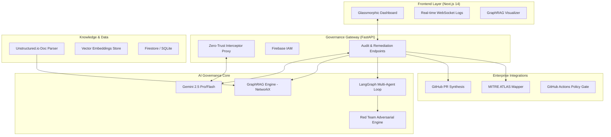
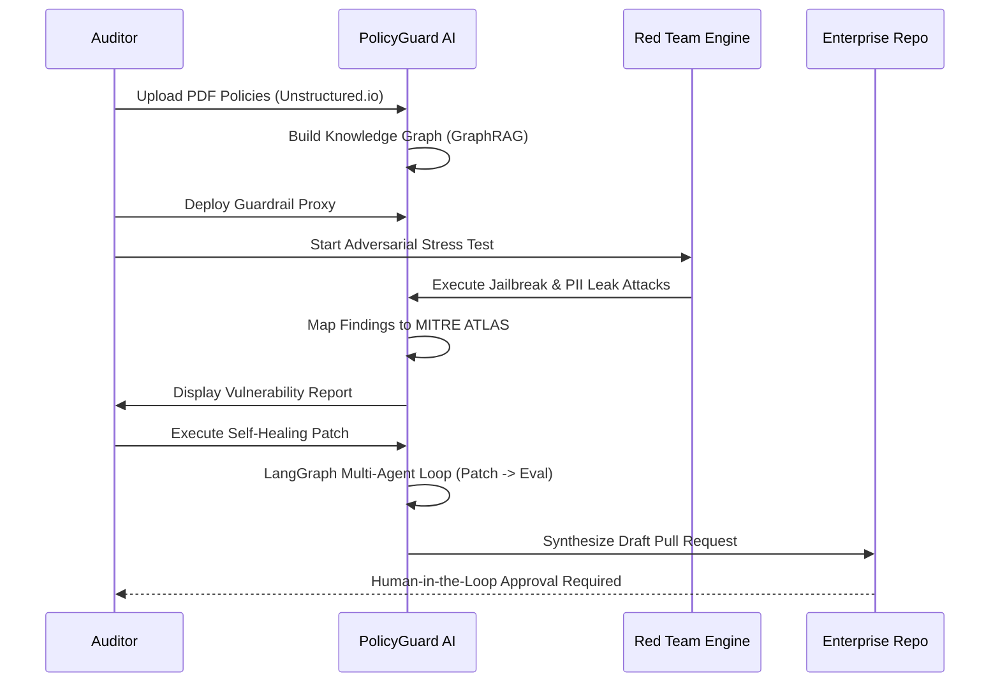

# PolicyGuard AI v2.0 🛡️

**The Autonomous Governance & Trust Layer for Enterprise Agentic Systems.**

---

## 🏗️ System Architecture
PolicyGuard AI is built as a multi-layered governance stack that sits between your enterprise applications and your LLM fleet.

---

## 🔄 End-to-End User Flow
From policy ingestion to autonomous remediation, here is how a security auditor interacts with the system:

---

## 🌟 Comprehensive Feature List

### 🧠 Intelligence Layer
- **GraphRAG Cognition**: Detects cross-document policy conflicts and "Longitudinal Harm" using NetworkX graphs.
- **Unstructured.io Parsing**: High-fidelity extraction of PDF, DOCX, and HTML documents including tables and headers.
- **Constitutional Scanning**: Analyzes Product Requirement Docs (PRDs) for compliance risk before coding begins.

### 🛡️ Defense Operations
- **Zero-Trust Interceptor Proxy**: Real-time semantic inspection of every prompt and response.
- **Red Team Engine**: 20+ automated adversarial tactics (Jailbreak, Mosaic, Roleplaying, Obfuscation).
- **MITRE ATLAS™ Mapping**: Instant alignment of AI vulnerabilities to industry-standard cybersecurity taxonomies.
- **PII & Secret Redaction**: Multi-layer masking of emails, keys, and sensitive entities via local NLP.

### 🔄 Self-Healing & DevOps
- **LangGraph Closed-Loop Eval**: Multi-agent orchestration (RedTeam -> Patch -> Eval) to verify guardrail efficacy.
- **Autonomous PR Synthesis**: Generates GitHub Pull Requests with patched guardrail code for Human-in-the-Loop review.
- **GitHub Action Policy Gate**: A CI/CD gate that blocks commits violating your organization's AI policies.
- **Smart Quota Cascade**: Multi-API key rotation and model switching (Pro/Flash/Lite) for 99.9% uptime.

### 📊 Analytics & Visibility
- **Glassmorphic OS Dashboard**: Premium, real-time UI with live trace visualization.
- **SLA Reliability Monitoring**: Tracks latency, uptime, and throughput for regulatory compliance.
- **Sovereign Trust Score**: A dynamic 0-100% KPI reflecting your fleet's overall security posture.
- **Exportable PDF Audits**: One-click generation of CISO-ready compliance reports.

---

## 👨‍⚖️ Judge's Walkthrough Flow
To see the full power of PolicyGuard AI, follow the sidebar menu from top to bottom:

1.  **Lifecycle Setup**: Go to `Policies` to upload your corporate rules. Use the `Integration Wizard` to connect your agents.
2.  **Adversarial Stress**: Launch a `Red Team` simulation to find vulnerabilities mapped to the MITRE ATLAS framework.
3.  **Runtime Shield**: Check the `Live Monitor` to see the Real-time Proxy intercepting and blocking violations.
4.  **Self-Healing AI**: Use `Remediate` to auto-generate hot-patches and synthesize **GitHub Pull Requests**.
5.  **Executive Overview**: View the final `Dashboard` for the high-level Trust Score and compliance posture.

---

Built with ❤️ for **AI Safety & Enterprise Sovereignty**.
*Utilizing Gemini 2.5 Flash-Lite for high-efficiency governance.*
